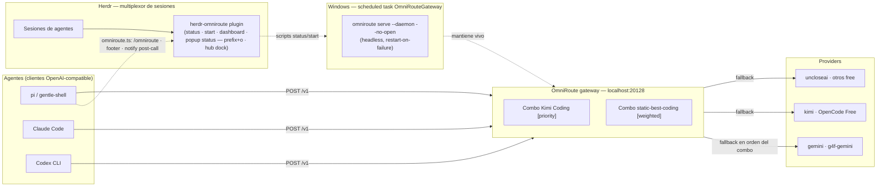

# herdr-omniroute

[](LICENSE)

Status, start and dashboard actions for the [OmniRoute](https://github.com/montesgp/omniroute)
auto-fallback gateway, which listens on `localhost:20128` and routes agent traffic
to a combo of providers so an exhausted token never kills a session. Plus a pi
extension that surfaces gateway state and warns after a failed call, and the
**Herdr Hub** — a thin multi-widget dock anchored to the right of a workspace.

> This repo is the **thin control layer** — the gateway itself is not here.
> Providers, combos and tokens stay in OmniRoute's own storage and user config,
> so tool updates never break these files.

## Architecture (where this sits)



**How it works**

1. Any OpenAI-compatible agent (pi, Claude Code, Codex CLI) calls `http://localhost:20128/v1`.
2. OmniRoute picks the active combo — `Kimi Coding [priority]` or `static-best-coding [weighted]`.
3. The combo serves providers in order/weight; when one is exhausted (429/5xx), the next one answers the same request. The agent never sees the failure.
4. On demand, Herdr opens the **status popup** (`OmniRoute Gateway`) — a single session-modal window with one **snapshot** of gateway UP/DOWN and the configured combos, taken at open time. There is **no auto refresh**: the frame is painted once and never repainted, so reopening the popup is how you get fresh data. It closes on `q` or Enter only and is hard-capped at `-MaxSeconds`; nothing opens automatically on session restore. Sessions can also check/start the gateway via the plugin actions or `prefix+o`; pi shows a footer dot (`●`/`○`) and warns on non-2xx post-call responses.

Full layered description: [docs/architecture.md](docs/architecture.md).

## Components

| Component | Location | Role |
| --- | --- | --- |
| Herdr plugin | `herdr-plugin.toml` + `scripts/*.ps1` | `status` / `start` / `dashboard` / `open-status-pane` / `hub` workspace actions |
| Status popup | `scripts/status-dashboard.ps1` + `[[panes]]` | On-demand popup "OmniRoute Gateway" — one snapshot of UP/DOWN + combos at open time, no auto refresh, closes on `q` or Enter; no auto-open |
| Popup opener | `scripts/open-status-pane.ps1` | Single windowless `plugin pane open` call for the popup (a popup is a session singleton, so no pane probing) |
| Herdr Hub | `scripts/hub/*` | Thin dock pane on the right of a workspace: one icon per widget, expand with `1`-`3`, `q`/`Esc` closes it. Idempotent per workspace. [docs/hub.md](docs/hub.md) |
| pi extension | `extensions/omniroute.ts` | `/omniroute` command, footer status, `after_provider_response` warning |
| Launcher | `omniroute-start.cmd` (user profile) + scheduled task `OmniRouteGateway` | headless `serve --daemon --no-open` at logon, restart-on-failure |
| OmniRoute gateway | `localhost:20128` (data in `~/.omniroute`) | combos + provider routing; not modified by this repo |

## Install

Local development (link the working directory):

```bash
herdr plugin link C:\repositories\personal\herdr-omniroute
```

From GitHub:

```bash
herdr plugin install montesgp/herdr-omniroute
```

pi extension (deploy after pulling this repo):

```bash
copy extensions\omniroute.ts %USERPROFILE%\.pi\agent\extensions\omniroute.ts
```

Linking and installing both work without a running Herdr server.

## Actions

| Action | Command | Behavior |
| --- | --- | --- |
| `herdr.omniroute.status` | `scripts/status.ps1` | Reports whether port 20128 is listening. Exit 0 = up, exit 1 = down. |
| `herdr.omniroute.start` | `scripts/start.ps1` | No-op when the gateway is already up; otherwise launches `omniroute serve --daemon --no-open`. |
| `herdr.omniroute.dashboard` | `scripts/dashboard.ps1` | Opens `http://localhost:20128` in the default browser. |
| `herdr.omniroute.open-status-pane` | `scripts/open-status-pane.ps1` | Opens the single status popup. If another Herdr modal is active it says so and exits 0. |
| `herdr.omniroute.hub` | `scripts/hub/open-hub.ps1` | Opens the Herdr Hub dock (~37 cols, right of the current workspace) or says it is already open. `q`/`Esc` closes it. [docs/hub.md](docs/hub.md) |

Actions are declared for the `workspace` context, so they show up in a workspace's
action list.

## Keybinding

Suggested binding in `%APPDATA%\herdr\config.toml`:

```toml
[[keys.command]]
key = "prefix+o"
type = "plugin_action"
command = "herdr.omniroute.open-status-pane"
description = "open OmniRoute status popup"
```

## Status popup

The plugin declares a `status` pane with `placement = "popup"` that runs
`scripts/status-dashboard.ps1`: a **single snapshot** of gateway UP/DOWN, the configured
combos and the time the snapshot was taken.

## Snapshot at open, no auto refresh

The frame is painted **once**, at open time, and is **never repainted**. There is no render
loop, no refresh interval and no `-RefreshSec` parameter. Repainting every couple of seconds
only lagged the screen and provided no value, so **reopening the popup is how you get fresh
data**.

The script therefore does not exit right after painting: a popup is a session modal that
closes when its command exits, so exiting immediately would make the popup vanish before it
could be read. Instead it paints one frame and then stays alive waiting for a key **without
redrawing anything**.

A popup is a **session-modal terminal**: it has no pane id, it takes all terminal input, and
it closes by itself when its command exits. That gives three guarantees:

- **Nothing opens automatically.** There is no `[[startup]]` block, so a session restore never
  spawns a dashboard. The popup only appears when you ask for it — via `prefix+o` or the action.
- **Only `q` or Enter closes it.** The dashboard polls `[Console]::KeyAvailable` and exits with
  code 0, which is what closes the popup. Every other key, Escape included, is consumed and
  ignored: a session modal swallows the whole input stream, so an any-key rule let ambient
  bytes from an agent dismiss the popup.
- **Its lifetime is bounded.** `-MaxSeconds` (default 300) is a hard cap enforced in every
  code path, including the fallback used when the host cannot report keypresses, so a popup
  can never become an orphan loop.

Because the popup is a session singleton, the opener is a single
`herdr plugin pane open --plugin herdr.omniroute --entrypoint status` call. There is no
workspace enumeration and no existing-pane detection: the running command *is* the state.

## Where the data comes from

The frame never starts the OmniRoute CLI. The old `node omniroute.mjs combo list` path cost
**3–9 s per frame** and spawned the CLI with a visible console, which is what flashed windows
on the Windows Terminal broker. Two causes, both fixed by not using that path:

- **Slowness.** The CLI boots `tsx` + Commander, then `isServerUp()` spends a health budget
  timing out before routing even starts.
- **Flashing.** `bin/cli/utils/cliToken.mjs` reads the machine id through `node-machine-id`,
  which runs `REG.exe QUERY` via `execSync(..., { shell: true, windowsHide: false })` — that
  allocates a console host, so the child gets a window.

The popup now reads the same `storage.sqlite` the gateway uses, **read-only**, through
`scripts/lib/Get-OmniRouteCombos.ps1` and `scripts/lib/Read-SqliteQuery.ps1`:

- **Preferred:** `sqlite3.exe` on `PATH`, run through the windowless helper with `-readonly`
  and a bounded `.timeout`. The read itself is **33–57 ms**.
- **Fallback:** a P/Invoke binding to Windows' own `winsqlite3.dll`, compiled on demand, opened
  with `SQLITE_OPEN_READONLY`. Used when there is no `sqlite3.exe`, or when the installed build
  rejects the statement (an old build without JSON support), which is retried with a statement
  that needs no JSON functions.

Both reads are `SELECT`-only against the gateway's own database, and the popup renders
`(datos de combos no disponibles: …)` rather than an empty list when a read fails — a broken
read must never look like "no combos configured".

**Active combo marker is sourced honestly.** The gateway keeps the active combo in runtime
memory and only exposes it through `GET /api/settings`, which requires login (measured on this
install: 401 without a key, ~2.1 s). Because it is not in `storage.sqlite`, the popup draws the
`●`/`○` icons only when the reader actually finds an `activeCombo` setting in `key_value`;
otherwise it prints an honest `(combo activo: no disponible - el gateway pide login)` line
instead of inventing a state. A real marker needs a gateway API key (open workstream).

`-Once` measures **~630 ms end to end**, down from **6059 ms**. Almost all of what is left is
Windows PowerShell cold start: an empty `powershell -NoProfile -File` script costs
**223–299 ms** on this machine, and the first real operation in a process costs another
~53 ms, so ~300 ms of a 300 ms budget is gone before any query starts. The remaining ~330 ms
is the two external calls (started together, so they overlap) and the render.

Every external command in the scripts runs through
`scripts/lib/Invoke-Native.ps1`, which uses `System.Diagnostics.Process` with
`UseShellExecute = $false` and `CreateNoWindow = $true`. Launching a console child the normal
way can allocate a console host (`conhost.exe`) and flash a terminal window; this helper
cannot.

- Open it right now: `herdr plugin action invoke herdr.omniroute.open-status-pane`
- Lifetime cap: `-MaxSeconds` (default 300), `-NoKeyWatch` to disable the keypress watch,
  `-Once` to render a single frame from a shell and exit immediately. There is no refresh
  parameter: the frame is a snapshot taken when the popup opens.
- Dismiss: `q` or Enter. Nothing else closes it.
- Render one frame without a popup: `powershell -File scripts\status-dashboard.ps1 -Once`

This is the **reusable pattern** for any future status plugin — full recipe in
[docs/status-panes.md](docs/status-panes.md).

## Herdr Hub dock

The hub is the plugin's persistent surface: a ~37 column pane split off the right
of the current workspace, showing one icon per widget.

```text
[HUB] 1 ◉  2 Σ  3 ⚙
1-3 expande · q cierra
```

- Open it: `herdr plugin action invoke herdr.omniroute.hub` (or bind a key to it).
- Expand: `1` OmniRoute, `2` Tokens, `3` Config. The same key again collapses.
- Close: `q`, `Q` or `Escape`. The hub closes its own pane, which restores the layout.
- Idempotent: a second invocation reports the existing pane and touches nothing.
- Collapsed, the strip never repaints. Expanded, it repaints every 15 s
  (`-RefreshSec`), and `-MaxSeconds` (default 1800) is a hard cap in every path.
- **Adding a widget is a module plus one registry line**: create
  `scripts/hub/widgets/<id>.ps1` exporting `Get-Widget<Id>`, then add
  `@{ Id = "..."; Key = "4"; Icon = ...; Title = "..." }` to `scripts/hub/widgets.ps1`.
  The `Tokens` stub is the worked example.

Everything is documented in [docs/hub.md](docs/hub.md): the widget contract, the
split mechanics, where each fact comes from and the troubleshooting table.

## Scope and lifetime

- **User-global by design.** Herdr plugins are per-user, not per-project: once linked
  or installed, the actions are available in every Herdr session.
- **The gateway runs headless.** A Windows scheduled task named `OmniRouteGateway`
  starts it at logon with `serve --daemon --no-open`, retries 3 times at a
  1-minute interval on failure, and has no execution time limit. No browser opens.
- **The status popup is on demand and short-lived.** It never opens on session
  restore, closes on `q` or Enter, and is capped at `-MaxSeconds`.
- **The hub dock is on demand and bounded too.** It is created by an explicit
  action, lives in one workspace, and closes itself on `q`/`Escape` or at
  `-MaxSeconds`. There is no `[[startup]]` hook, so restoring a session never
  opens a dock.
- **Personalization lives only in user files.** This repo holds the plugin scripts
  and a pi extension; provider, combo and token configuration stays in
  OmniRoute's own storage and in the user's Herdr/pi config directories. Nothing
  here writes into a tool's install directory, so plugin or agent updates do not
  break it.

## Branches

Simple promotion flow — everything converges on `main`:

| Branch | Purpose |
| --- | --- |
| `dev` | Active development |
| `staging` | Pre-release testing |
| `main` | Stable release |

## Requirements

- Windows
- Herdr 0.7.0 or newer
- OmniRoute reachable at `http://localhost:20128` (see the scheduled task above)

## License

[MIT](LICENSE) © 2026 montesgp