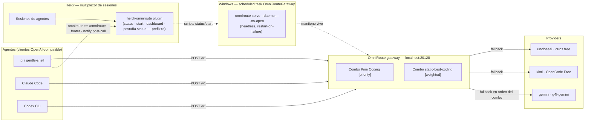

# herdr-omniroute

[](LICENSE)

Status, start and dashboard actions for the [OmniRoute](https://github.com/montesgp/omniroute)
auto-fallback gateway, which listens on `localhost:20128` and routes agent traffic
to a combo of providers so an exhausted token never kills a session. Plus a pi
extension that surfaces gateway state and warns after a failed call.

> This repo is the **thin control layer** — the gateway itself is not here.
> Providers, combos and tokens stay in OmniRoute's own storage and user config,
> so tool updates never break these files.

## Architecture (where this sits)



**How it works**

1. Any OpenAI-compatible agent (pi, Claude Code, Codex CLI) calls `http://localhost:20128/v1`.
2. OmniRoute picks the active combo — `Kimi Coding [priority]` or `static-best-coding [weighted]`.
3. The combo serves providers in order/weight; when one is exhausted (429/5xx), the next one answers the same request. The agent never sees the failure.
4. Herdr opens a dedicated **status tab** (`OmniRoute Gateway`) at session restore — UP/DOWN and the configured combos, live. Sessions can also check/start/open the gateway via the plugin actions or `prefix+o`; pi shows a footer dot (`●`/`○`) and warns on non-2xx post-call responses.

Full layered description: [docs/architecture.md](docs/architecture.md).

## Components

| Component | Location | Role |
| --- | --- | --- |
| Herdr plugin | `herdr-plugin.toml` + `scripts/*.ps1` | `status` / `start` / `dashboard` / `open-status-pane` workspace actions |
| Status pane | `scripts/status-dashboard.ps1` + `[[panes]]`/`[[startup]]` | Tab "OmniRoute Gateway" — live UP/DOWN + combos, auto-open at session restore |
| pi extension | `extensions/omniroute.ts` | `/omniroute` command, footer status, `after_provider_response` warning |
| Launcher | `omniroute-start.cmd` (user profile) + scheduled task `OmniRouteGateway` | headless `serve --daemon --no-open` at logon, restart-on-failure |
| OmniRoute gateway | `localhost:20128` (data in `~/.omniroute`) | combos + provider routing; not modified by this repo |

## Install

Local development (link the working directory):

```bash
herdr plugin link C:\repositories\personal\herdr-omniroute
```

From GitHub:

```bash
herdr plugin install montesgp/herdr-omniroute
```

pi extension (deploy after pulling this repo):

```bash
copy extensions\omniroute.ts %USERPROFILE%\.pi\agent\extensions\omniroute.ts
```

Linking and installing both work without a running Herdr server.

## Actions

| Action | Command | Behavior |
| --- | --- | --- |
| `herdr.omniroute.status` | `scripts/status.ps1` | Reports whether port 20128 is listening. Exit 0 = up, exit 1 = down. |
| `herdr.omniroute.start` | `scripts/start.ps1` | No-op when the gateway is already up; otherwise launches `omniroute serve --daemon --no-open`. |
| `herdr.omniroute.dashboard` | `scripts/dashboard.ps1` | Opens `http://localhost:20128` in the default browser. |
| `herdr.omniroute.open-status-pane` | `scripts/open-status-pane.ps1` | Re-opens the status tab if it was closed (idempotent). |

Actions are declared for the `workspace` context, so they show up in a workspace's
action list.

## Keybinding

Suggested binding in `%APPDATA%\herdr\config.toml`:

```toml
[[keys.command]]
key = "prefix+o"
type = "plugin_action"
command = "herdr.omniroute.status"
```

## Status pane

The plugin declares a `status` pane (placement `tab`) that runs
`scripts/status-dashboard.ps1`: a live dashboard showing gateway UP/DOWN, the configured
combos and a refresh timestamp. The `[[startup]]` hook re-opens the tab automatically every
time Herdr restores the session — the opener is idempotent, so it never duplicates the tab.

- Open it right now (no restart needed):
  `herdr plugin pane open --plugin herdr.omniroute --entrypoint status`
- Re-open from the action list: `herdr.omniroute.open-status-pane`.
- To stop auto-opening, remove the `[[startup]]` block from `herdr-plugin.toml`.

This is the **reusable pattern** for any future status plugin — full recipe in
[docs/status-panes.md](docs/status-panes.md).

## Scope and lifetime

- **User-global by design.** Herdr plugins are per-user, not per-project: once linked
  or installed, the actions are available in every Herdr session.
- **The gateway runs headless.** A Windows scheduled task named `OmniRouteGateway`
  starts it at logon with `serve --daemon --no-open`, retries 3 times at a
  1-minute interval on failure, and has no execution time limit. No browser opens.
- **Personalization lives only in user files.** This repo holds the plugin scripts
  and a pi extension; provider, combo and token configuration stays in
  OmniRoute's own storage and in the user's Herdr/pi config directories. Nothing
  here writes into a tool's install directory, so plugin or agent updates do not
  break it.

## Branches

Simple promotion flow — everything converges on `main`:

| Branch | Purpose |
| --- | --- |
| `dev` | Active development |
| `staging` | Pre-release testing |
| `main` | Stable release |

## Requirements

- Windows
- Herdr 0.7.0 or newer
- OmniRoute reachable at `http://localhost:20128` (see the scheduled task above)

## License

[MIT](LICENSE) © 2026 montesgp