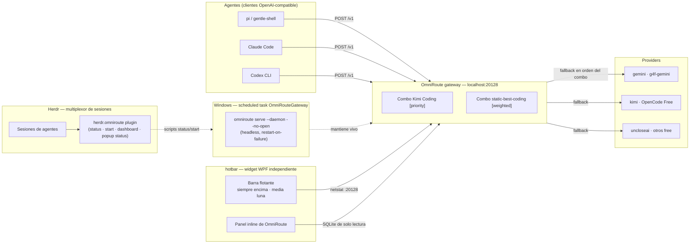

# hotbar

[](LICENSE)

A floating, always-on-top Windows bar — plus the [OmniRoute](https://github.com/montesgp/omniroute)
auto-fallback gateway control layer.

The bar lives above everything, including Herdr, in the shape of an elongated
half-moon: five cells on the right edge of your primary monitor, and one click on
the OmniRoute cell expands the gateway state inline. It is standalone: it is not
a Herdr pane, and it works whether or not Herdr is running.

> This repo is the **thin control layer** — the gateway itself is not here.
> Providers, combos and tokens stay in OmniRoute's own storage and user config,
> so tool updates never break these files.

## The hotbar widget

```text
  ╭──────────╮
  │        ▸ │   collapsed: a single tab, 46 px
  ╰──────────╯
```

Expanded it is a 72 x 400 vertical half-moon pinned to the right edge of the
primary monitor, vertically centred, with the panel opening to its left.

```powershell
.\hotbar\launch-hotbar.ps1
```

That is the whole install. No package manager, no build step, no runtime
downloads: Windows PowerShell 5.1, WPF and `sqlite3.exe` are already on the box.

- **Always on top, frameless, no taskbar entry.** `AllowsTransparency`,
  `WindowStyle=None`, `ShowInTaskbar=false`.
- **Single instance.** A named mutex refuses a second bar. Force-killing the
  widget releases an abandoned mutex that the next launch recovers, so a crash
  never wedges it permanently.
- **Collapse and expand.** The chevron at the top collapses the bar to a 46 px
  semicircular tab; the tab expands it again.
- **Right-click** for a context menu: open the config, reload it, collapse, quit.
  `Escape` quits too.
- **DPI-aware.** Screen pixels are converted to WPF device-independent units via
  `Graphics.FromHwnd(IntPtr.Zero).DpiX`, so the bar lands in the same physical
  spot on a scaled monitor.

### Items and actions

`hotbar/config.json` is the whole configuration. Items are rendered in order and
each one carries a glyph, a label, a tooltip and an action:

| Action | What it does |
| --- | --- |
| `none` | The cell is a placeholder. It renders and does nothing. |
| `omniroute-status` | Expands the inline panel with the gateway snapshot. |
| `edit-config` | Opens `config.json` in the default editor. |
| `run: <command>` | Runs a command. `.cmd`/`.bat` targets go through `cmd.exe /d /c`; an optional `cwd` is honoured. |

Glyphs are written as `0xNNNN` code points rather than literal characters, so the
whole tree stays pure ASCII and a wrong glyph is a parse error instead of a
mojibake surprise:

```json
{ "id": "omniroute", "label": "OmniRoute", "glyph": "0x25A3", "action": "omniroute-status" }
```

### The inline panel

The OmniRoute cell expands a panel to the left of the bar: gateway UP/DOWN on
`:20128`, the active combo and the configured combos, read from the gateway's own
SQLite. It is the same data path the plugin popup uses, described in
[Where the data comes from](#where-the-data-comes-from).

### Self test

```powershell
.\hotbar\launch-hotbar.ps1 -SelfTest
```

Prints one `HOTBAR_SELFTEST` line per check and returns a real exit code. It
parses the config, validates every glyph and action, loads the XAML, checks the
expanded/collapsed/panel geometry against the real screen, reads live gateway
data, shows the window for a few hundred milliseconds and closes it from a
`DispatcherTimer` with a watchdog behind it. A self-test that cannot fail is
worthless, so the failure path is exercised too: an unsupported action or a bad
glyph is reported per item and exits 1.

Nothing in the widget can hang the caller, and no test leaves a window behind.

## Architecture (where this sits)



**How it works**

1. Any OpenAI-compatible agent (pi, Claude Code, Codex CLI) calls `http://localhost:20128/v1`.
2. OmniRoute picks the active combo — `Kimi Coding [priority]` or `static-best-coding [weighted]`.
3. The combo serves providers in order/weight; when one is exhausted (429/5xx), the next one answers the same request. The agent never sees the failure.
4. The bar reads the gateway directly and is completely independent of Herdr. The Herdr
   plugin is the older, in-TUI surface: it opens a session-modal status popup on demand,
   with one **snapshot** of gateway UP/DOWN and the configured combos taken at open time.
   There is **no auto refresh**: the frame is painted once and never repainted, so
   reopening the popup is how you get fresh data.

Full layered description: [docs/architecture.md](docs/architecture.md).

## Components

| Component | Location | Role |
| --- | --- | --- |
| Hotbar widget | `hotbar/hotbar.ps1` | The WPF window: always-on-top, transparent, frameless, half-moon, collapse/expand, inline panel |
| Launcher | `hotbar/launch-hotbar.ps1` | Starts the widget hidden on an STA thread; refuses a second instance |
| Config | `hotbar/config.json` | Items, glyphs, labels, tooltips, actions, margin, monitor |
| Data readers | `hotbar/lib/*.ps1` | Standalone copies: netstat `:20128` probe, read-only combo reader, windowless process helper |
| Herdr plugin | `herdr-plugin.toml` + `scripts/*.ps1` | `status` / `start` / `dashboard` / `open-status-pane` workspace actions |
| Status popup | `scripts/status-dashboard.ps1` + `[[panes]]` | On-demand popup "OmniRoute Gateway" — one snapshot of UP/DOWN + combos at open time, no auto refresh, closes on `q` or Enter; no auto-open |
| Popup opener | `scripts/open-status-pane.ps1` | Single windowless `plugin pane open` call for the popup (a popup is a session singleton, so no pane probing) |
| pi extension | `extensions/omniroute.ts` | `/omniroute` command, footer status, `after_provider_response` warning |
| Launcher | `omniroute-start.cmd` (user profile) + scheduled task `OmniRouteGateway` | headless `serve --daemon --no-open` at logon, restart-on-failure |
| OmniRoute gateway | `localhost:20128` (data in `~/.omniroute`) | combos + provider routing; not modified by this repo |

The widget and the plugin deliberately keep **separate copies** of the data
readers. The widget has to run without the plugin being linked into Herdr, and a
copy is cheaper than a resolution scheme that would fail in exactly the case the
widget exists to cover.

## Install

The bar needs no install. Clone and launch it:

```bash
git clone https://github.com/montesgp/hotbar
cd hotbar
powershell -ExecutionPolicy Bypass -File .\hotbar\launch-hotbar.ps1
```

The Herdr plugin is optional. Local development (link the working directory):

```bash
herdr plugin link C:\repositories\personal\herdr-omniroute
```

From GitHub:

```bash
herdr plugin install montesgp/herdr-omniroute
```

pi extension (deploy after pulling this repo):

```bash
copy extensions\omniroute.ts %USERPROFILE%\.pi\agent\extensions\omniroute.ts
```

Linking and installing both work without a running Herdr server.

## Actions

| Action | Command | Behavior |
| --- | --- | --- |
| `herdr.omniroute.status` | `scripts/status.ps1` | Reports whether port 20128 is listening. Exit 0 = up, exit 1 = down. |
| `herdr.omniroute.start` | `scripts/start.ps1` | No-op when the gateway is already up; otherwise launches `omniroute serve --daemon --no-open`. |
| `herdr.omniroute.dashboard` | `scripts/dashboard.ps1` | Opens `http://localhost:20128` in the default browser. |
| `herdr.omniroute.open-status-pane` | `scripts/open-status-pane.ps1` | Opens the single status popup. If another Herdr modal is active it says so and exits 0. |

Actions are declared for the `workspace` context, so they show up in a workspace's
action list.

## Keybinding

Suggested binding in `%APPDATA%\herdr\config.toml`:

```toml
[[keys.command]]
key = "prefix+o"
type = "plugin_action"
command = "herdr.omniroute.open-status-pane"
description = "open OmniRoute status popup"
```

## Status popup

The plugin declares a `status` pane with `placement = "popup"` that runs
`scripts/status-dashboard.ps1`: a **single snapshot** of gateway UP/DOWN, the configured
combos and the time the snapshot was taken.

## Snapshot at open, no auto refresh

The frame is painted **once**, at open time, and is **never repainted**. There is no render
loop, no refresh interval and no `-RefreshSec` parameter. Repainting every couple of seconds
only lagged the screen and provided no value, so **reopening the popup is how you get fresh
data**.

The script therefore does not exit right after painting: a popup is a session modal that
closes when its command exits, so exiting immediately would make the popup vanish before it
could be read. Instead it paints one frame and then stays alive waiting for a key **without
redrawing anything**.

A popup is a **session-modal terminal**: it has no pane id, it takes all terminal input, and
it closes by itself when its command exits. That gives three guarantees:

- **Nothing opens automatically.** There is no `[[startup]]` block, so a session restore never
  spawns a dashboard. The popup only appears when you ask for it — via `prefix+o` or the action.
- **Only `q` or Enter closes it.** The dashboard polls `[Console]::KeyAvailable` and exits with
  code 0, which is what closes the popup. Every other key, Escape included, is consumed and
  ignored: a session modal swallows the whole input stream, so an any-key rule let ambient
  bytes from an agent dismiss the popup.
- **Its lifetime is bounded.** `-MaxSeconds` (default 300) is a hard cap enforced in every
  code path, including the fallback used when the host cannot report keypresses, so a popup
  can never become an orphan loop.

Because the popup is a session singleton, the opener is a single
`herdr plugin pane open --plugin herdr.omniroute --entrypoint status` call. There is no
workspace enumeration and no existing-pane detection: the running command *is* the state.

## Where the data comes from

Neither the bar nor the popup ever starts the OmniRoute CLI. The old
`node omniroute.mjs combo list` path cost **3–9 s per frame** and spawned the CLI with a
visible console, which is what flashed windows on the Windows Terminal broker. Two causes,
both fixed by not using that path:

- **Slowness.** The CLI boots `tsx` + Commander, then `isServerUp()` spends a health budget
  timing out before routing even starts.
- **Flashing.** `bin/cli/utils/cliToken.mjs` reads the machine id through `node-machine-id`,
  which runs `REG.exe QUERY` via `execSync(..., { shell: true, windowsHide: false })` — that
  allocates a console host, so the child gets a window.

Both surfaces read the same `storage.sqlite` the gateway uses, **read-only**, through
`Get-OmniRouteCombos.ps1` and `Read-SqliteQuery.ps1`:

- **Preferred:** `sqlite3.exe` on `PATH`, run through the windowless helper with `-readonly`
  and a bounded `.timeout`. The read itself is **33–57 ms**.
- **Fallback:** a P/Invoke binding to Windows' own `winsqlite3.dll`, compiled on demand, opened
  with `SQLITE_OPEN_READONLY`. Used when there is no `sqlite3.exe`, or when the installed build
  rejects the statement (an old build without JSON support), which is retried with a statement
  that needs no JSON functions.

Both reads are `SELECT`-only against the gateway's own database, and both surfaces render an
explicit "not available" line rather than an empty list when a read fails — a broken read must
never look like "no combos configured".

**Active combo marker is sourced honestly.** The gateway keeps the active combo in runtime
memory and only exposes it through `GET /api/settings`, which requires login (measured on this
install: 401 without a key, ~2.1 s). Because it is not in `storage.sqlite`, the icons are
drawn only when the reader actually finds an `activeCombo` setting in `key_value`; otherwise it
prints an honest `(combo activo: no disponible - el gateway pide login)` line instead of
inventing a state. A real marker needs a gateway API key (open workstream).

`-Once` measures **~630 ms end to end**, down from **6059 ms**. Almost all of what is left is
Windows PowerShell cold start: an empty `powershell -NoProfile -File` script costs
**223–299 ms** on this machine, and the first real operation in a process costs another
~53 ms, so ~300 ms of a 300 ms budget is gone before any query starts. The remaining ~330 ms
is the two external calls (started together, so they overlap) and the render.

Every external command in both surfaces runs through a windowless helper that uses
`System.Diagnostics.Process` with `UseShellExecute = $false` and `CreateNoWindow = $true`.
Launching a console child the normal way can allocate a console host (`conhost.exe`) and flash
a terminal window; this helper cannot.

- Open it right now: `herdr plugin action invoke herdr.omniroute.open-status-pane`
- Lifetime cap: `-MaxSeconds` (default 300), `-NoKeyWatch` to disable the keypress watch,
  `-Once` to render a single frame from a shell and exit immediately. There is no refresh
  parameter: the frame is a snapshot taken when the popup opens.
- Dismiss: `q` or Enter. Nothing else closes it.
- Render one frame without a popup: `powershell -File scripts\status-dashboard.ps1 -Once`

This is the **reusable pattern** for any future status plugin — full recipe in
[docs/status-panes.md](docs/status-panes.md). The hotbar widget is the other reusable shape:
same data, no terminal, no session modal.

## Scope and lifetime

- **The bar is per-user and explicit.** It starts when you launch it and lives until you quit
  it. It is not a Herdr pane, so restoring a Herdr session never spawns it, and Herdr not
  running has no effect on it.
- **The plugin is user-global by design.** Herdr plugins are per-user, not per-project: once
  linked or installed, the actions are available in every Herdr session.
- **The gateway runs headless.** A Windows scheduled task named `OmniRouteGateway`
  starts it at logon with `serve --daemon --no-open`, retries 3 times at a
  1-minute interval on failure, and has no execution time limit. No browser opens.
- **The status popup is on demand and short-lived.** It never opens on session
  restore, closes on `q` or Enter, and is capped at `-MaxSeconds`.
- **Personalization lives only in user files.** This repo holds the widget, the plugin
  scripts and a pi extension; provider, combo and token configuration stays in
  OmniRoute's own storage and in the user's Herdr/pi config directories. Nothing
  here writes into a tool's install directory, so plugin or agent updates do not
  break it.

## Branches

Simple promotion flow — everything converges on `main`:

| Branch | Purpose |
| --- | --- |
| `dev` | Active development |
| `staging` | Pre-release testing |
| `main` | Stable release |

## Requirements

- Windows
- Windows PowerShell 5.1 (the widget is WPF and needs STA; the launcher handles it)
- `sqlite3.exe` on `PATH` for combo data, with a `winsqlite3.dll` fallback if absent
- OmniRoute reachable at `http://localhost:20128` for the status read
- Herdr 0.7.0 or newer — only if you want the plugin surface

## License

[MIT](LICENSE) © 2026 montesgp
