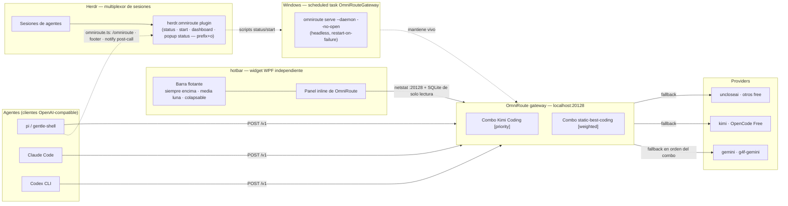

# Architecture — hotbar

## What this is

`hotbar` is the **thin control layer** for the [OmniRoute](https://github.com/montesgp/omniroute)
auto-fallback gateway. It does not implement routing, provide tokens, or run the
gateway process itself — it makes the gateway *visible and alive* from the places
the user actually works: a floating bar over the desktop, the Herdr session
multiplexer, and the pi agent.

The bar is the primary surface. The Herdr plugin is the older, in-TUI one and
stays supported.

## Where it mounts



## Layers

| Layer | Component | Responsibility |
| --- | --- | --- |
| 0a — Widget | `hotbar/hotbar.ps1` + `launch-hotbar.ps1` | Floating always-on-top half-moon bar: 4-5 config-driven cells, collapse/expand, inline OmniRoute panel, single instance |
| 0b — Interfaz | Herdr + plugin + pi extension | The older in-TUI surface: on-demand status popup (one snapshot of UP/DOWN + combos), status dot, actions, `/omniroute` |
| 1 — Agentes | pi, Claude Code, Codex CLI | Arbitrary OpenAI-compatible clients that POST to `:20128/v1` |
| 2 — Gateway | OmniRoute (`localhost:20128`) | Single entry point; owns combos and provider routing |
| 3 — Providers | gemini, kimi, OpenCode Free, uncloseai, ... | Real backends; exhausted/slow ones are bypassed by the combo |
| 4 — Infra | Scheduled task `OmniRouteGateway` + `omniroute-start.cmd` | Keeps the gateway running across logons and crashes |

## The widget layer

The bar is deliberately **not** a Herdr pane. Three constraints drove that:

- **It must outlive the session.** A pane is opened and closed by Herdr; the bar
  is a desktop fixture that must stay up whether Herdr is running, restored, or
  absent.
- **It must not cost layout space.** `placement = "popup"` reserves nothing while
  closed and borrows the terminal while open. A topmost window costs nothing at
  all and draws over Herdr instead of inside it.
- **It must not depend on a terminal.** The popup is a session modal: it takes
  the whole input stream, so an agent's stray bytes can dismiss it. A WPF window
  has an ordinary event loop and no such coupling.

`hotbar/hotbar.ps1` owns the window; `hotbar/launch-hotbar.ps1` owns the host
concerns (STA apartment, hidden console, second-instance refusal) so the widget
itself only ever has to assume it is already on a pumped STA thread.

Shape and geometry are computed, not hardcoded. The bar is a half-ellipse
`72 x 400` produced by an asymmetric `CornerRadius="200,0,0,200"`, and the item
column is right-aligned and sized against the curve:

```text
usable width at row y = 72 * sqrt(1 - ((y - 200) / 200)^2)
```

The content spans `dy 68..332`, where that curve leaves 54 px for a 44 px column.
Sizing the cells by eye instead sliced the outer items with the bulge.

The window keeps its **right** edge pinned to the monitor's working area and
shifts left by the panel width when the panel opens, so the crescent never leaves
the screen. That is why the bar is the last grid column and why `BarBorder`
carries no `Width`: pinning it to 72 would centre it inside the wider
panel-open window.

## How a request flows

1. An agent calls `http://localhost:20128/v1` (any OpenAI-compatible shape).
2. OmniRoute resolves the **active combo**: `Kimi Coding [priority]` (explicit order)
   or `static-best-coding [weighted]` (automatic weighted scoring that mostly uses
   Gemini).
3. The combo starts with its first provider; on exhaustion or failure (429, 5xx,
   timeout) the **next provider in the combo serves the same request**.
4. The agent sees one seamless response. No agent-side fallback logic exists —
   that is deliberate: an HTTP request cannot be paused, so the gateway is the
   only layer where transparent failover is possible.
5. Control feedback outside the data path:
   - The **hotbar** reads the gateway on demand: the port check plus the same
     read-only SQLite query the popup uses, painted into the inline panel when
     the OmniRoute cell is clicked. No layout cost, no session modal, no
     auto-open.
   - Herdr plugin reports UP/DOWN and can (re)start the daemon (`prefix+o`).
     The detail is an on-demand popup showing one snapshot taken at open time
     (no auto refresh, closes on `q` or Enter), never an auto-opened surface.
   - pi extension shows a footer status and warns on non-2xx
     `after_provider_response`.

## How the status surfaces get their data

Neither the bar nor the popup calls the OmniRoute CLI. Both read the gateway's
own `storage.sqlite` with a `SELECT`-only, read-only connection, and both probe
`:20128` with `netstat`. That is a deliberate boundary, not an optimisation:

- **Latency.** `node omniroute.mjs combo list` cost 3–9 s per frame. The CLI
  boots `tsx` + Commander, and `isServerUp()` burns a health budget timing out
  before routing even starts. A direct read costs 33–57 ms.
- **No visible console.** `bin/cli/utils/cliToken.mjs` gets the machine id via
  `node-machine-id`, which runs `REG.exe QUERY` through `execSync(...,
  { shell: true, windowsHide: false })`. That allocates a console host, so every
  popup flashed a terminal window on the Windows Terminal broker. The direct read
  launches nothing that wants a window.

Because both the read and the port check are independent, they are started
through `Start-NativeProcess` and collected afterwards, so the frame pays for
the slower one instead of their sum. A failed read renders
`(datos de combos no disponibles: …)` — never an empty list, because a broken
read must not look like "no combos configured".

The widget keeps **its own copies** of these readers under `hotbar/lib/`. It has
to work when the plugin is not linked into Herdr, and a duplicated 200-line
reader is cheaper than a resolution scheme that fails in precisely the situation
the widget exists to cover. The copies are deliberately identical in behaviour:
same `-readonly` flags, same bounded `.timeout`, same honest "no data" line.

## Why personalization lives in the outer layer (anti-breakage contract)

- All runtime configuration stays in **user files**: `~/.pi/agent/extensions/`,
  `%APPDATA%\herdr\config.toml`, `%USERPROFILE%\omniroute-start.cmd`,
  Task Scheduler, and OmniRoute's own `~/.omniroute` data.
- This repo never writes into a tool's install directory: not into
  `node_modules` of pi/gentle-pi, not into the Herdr binary, not into the
  OmniRoute package. Updates to those tools can never silently overwrite these
  files.
- If pi or Herdr change their extension/plugin format, the fix is applied in
  this repo (or the user config), not inside a vendored dependency.

## Components in this repo

| Path | Purpose |
| --- | --- |
| `hotbar/hotbar.ps1` | The widget: embedded XAML, always-on-top window, half-moon bar, collapse/expand, inline panel, single-instance mutex, `-SelfTest` |
| `hotbar/launch-hotbar.ps1` | Host launcher: STA apartment, hidden console, second-instance refusal, `-SelfTest` passthrough |
| `hotbar/config.json` | Items, glyphs (`0xNNNN` code points), labels, tooltips, actions, margin |
| `hotbar/lib/Invoke-Native.ps1` | Windowless external-command helper (`CreateNoWindow`), standalone copy |
| `hotbar/lib/Get-OmniRouteStatus.ps1` | `:20128` listening probe, standalone copy |
| `hotbar/lib/Read-SqliteQuery.ps1` | Read-only SQLite query: `sqlite3.exe` first, P/Invoke over `winsqlite3.dll` as fallback |
| `hotbar/lib/Get-OmniRouteCombos.ps1` | Resolves OmniRoute's `storage.sqlite` and maps the combos table into the panel's fields |
| `herdr-plugin.toml` | Herdr plugin manifest (4 workspace actions, 1 popup, no startup hook) |
| `scripts/status.ps1` | Port 20128 check; exit 0 = up, 1 = down |
| `scripts/start.ps1` | No-op if up; else `serve --daemon --no-open` |
| `scripts/dashboard.ps1` | Opens `http://localhost:20128` |
| `scripts/lib/Invoke-Native.ps1` | Windowless external-command helper (`CreateNoWindow`) shared by the scripts. `Start-NativeProcess` / `Complete-NativeProcess` are split so two calls can be in flight at once |
| `scripts/lib/Read-SqliteQuery.ps1` | Read-only SQLite query: `sqlite3.exe` first, P/Invoke over `winsqlite3.dll` as fallback |
| `scripts/lib/Get-OmniRouteCombos.ps1` | Resolves OmniRoute's `storage.sqlite` and maps the combos table into the frame's fields |
| `scripts/status-dashboard.ps1` | Single-snapshot frame for the status popup: reads SQLite and checks the port in parallel, paints once, never repaints, then waits for `q`/Enter (`-MaxSeconds` cap, `-Once` test switch) |
| `scripts/open-status-pane.ps1` | Opens the single status popup (one `plugin pane open` call, no pane probing) |
| `docs/status-panes.md` | Reusable pattern for future status plugins |
| `docs/hotbar.md` | Hotbar guide: config schema, actions, geometry, troubleshooting |
| `extensions/omniroute.ts` | pi extension source (deployed to `~/.pi/agent/extensions/`) |
| `odd/tasks/hotbar-widget.md` | Widget feature tracker (ODD) — the source of truth for this rebrand |
| `odd/tasks/omniroute-autofallback.md` | Feature tracker (ODD) — evidence of what was built and verified |
| `odd/tasks/herdr-hub.md` | Retired hub feature tracker (ODD) — kept as history, superseded by the widget |

## Branching

Simple promotion flow, everything converges on `main`:

```
dev ──► staging ──► main
```

- `dev` — active development.
- `staging` — pre-release testing.
- `main` — stable release; all promoted work lives here.