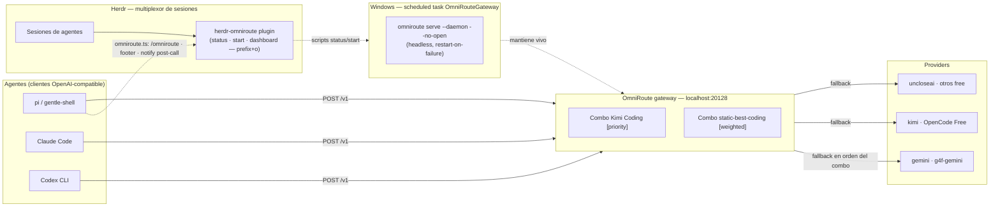

# Architecture — herdr-omniroute

## What this is

`herdr-omniroute` is the **thin control layer** for the [OmniRoute](https://github.com/montesgp/omniroute)
auto-fallback gateway. It does not implement routing, provide tokens, or run the
gateway process itself — it makes the gateway *visible and alive* from the two
places the user actually works: the Herdr session multiplexer and the pi agent.

## Where it mounts



## Layers

| Layer | Component | Responsibility |
| --- | --- | --- |
| 0 — Interfaz | Herdr + plugin + pi extension | Visibility and control: status dot, start action, dashboard, `/omniroute` |
| 1 — Agentes | pi, Claude Code, Codex CLI | Arbitrary OpenAI-compatible clients that POST to `:20128/v1` |
| 2 — Gateway | OmniRoute (`localhost:20128`) | Single entry point; owns combos and provider routing |
| 3 — Providers | gemini, kimi, OpenCode Free, uncloseai, ... | Real backends; exhausted/slow ones are bypassed by the combo |
| 4 — Infra | Scheduled task `OmniRouteGateway` + `omniroute-start.cmd` | Keeps the gateway running across logons and crashes |

## How a request flows

1. An agent calls `http://localhost:20128/v1` (any OpenAI-compatible shape).
2. OmniRoute resolves the **active combo**: `Kimi Coding [priority]` (explicit order)
   or `static-best-coding [weighted]` (automatic weighted scoring that mostly uses
   Gemini).
3. The combo starts with its first provider; on exhaustion or failure (429, 5xx,
   timeout) the **next provider in the combo serves the same request**.
4. The agent sees one seamless response. No agent-side fallback logic exists —
   that is deliberate: an HTTP request cannot be paused, so the gateway is the
   only layer where transparent failover is possible.
5. Control feedback outside the data path:
   - Herdr plugin reports UP/DOWN and can (re)start the daemon (`prefix+o`).
   - pi extension shows a footer status (`●`/`○`) and warns on non-2xx
     `after_provider_response`.

## Why personalization lives in the outer layer (anti-breakage contract)

- All runtime configuration stays in **user files**: `~/.pi/agent/extensions/`,
  `%APPDATA%\herdr\config.toml`, `%USERPROFILE%\omniroute-start.cmd`,
  Task Scheduler, and OmniRoute's own `~/.omniroute` data.
- This repo never writes into a tool's install directory: not into
  `node_modules` of pi/gentle-pi, not into the Herdr binary, not into the
  OmniRoute package. Updates to those tools can never silently overwrite these
  files.
- If pi or Herdr change their extension/plugin format, the fix is applied in
  this repo (or the user config), not inside a vendored dependency.

## Components in this repo

| Path | Purpose |
| --- | --- |
| `herdr-plugin.toml` | Herdr plugin manifest (3 workspace actions) |
| `scripts/status.ps1` | Port 20128 check; exit 0 = up, 1 = down |
| `scripts/start.ps1` | No-op if up; else `serve --daemon --no-open` |
| `scripts/dashboard.ps1` | Opens `http://localhost:20128` |
| `extensions/omniroute.ts` | pi extension source (deployed to `~/.pi/agent/extensions/`) |
| `odd/tasks/omniroute-autofallback.md` | Feature tracker (ODD) — evidence of what was built and verified |

## Branching

Simple promotion flow, everything converges on `main`:

```
dev ──► staging ──► main
```

- `dev` — active development.
- `staging` — pre-release testing.
- `main` — stable release; all promoted work lives here.